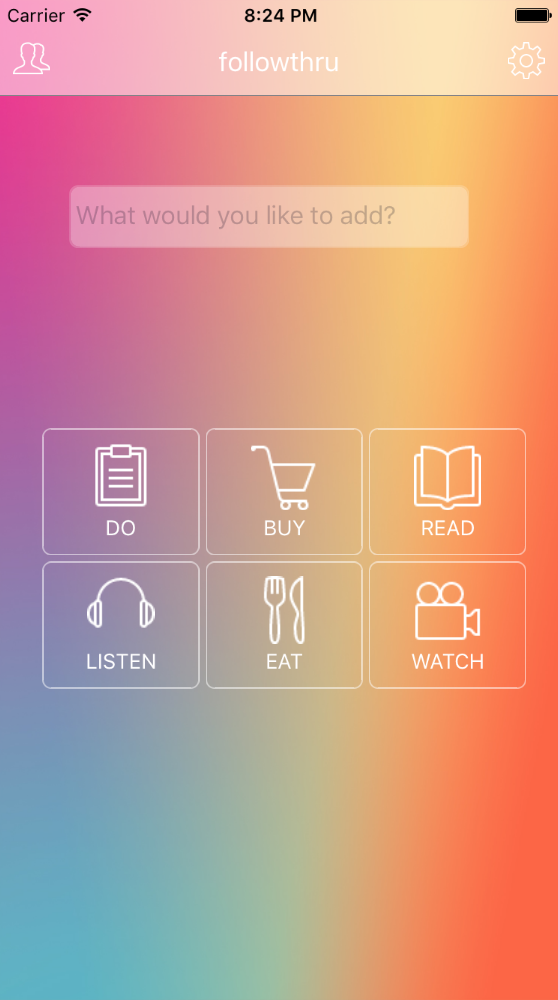

[](https://waffle.io/HRR16-triceratops/triceratops)
# Project Name
followThru

## Team

  - __Product Owner__: Andrew Vye
  - __Scrum Master__: S.B. Lee
  - __Development Team Members__: Brent Colson, Keeley Nakamoto

## Table of Contents

1. [Usage](#Usage)
1. [Requirements](#requirements)
1. [Development](#development)
    1. [Installing Dependencies](#installing-dependencies)
    1. [Tasks](#tasks)
    1. [Run ios app](#run-ios-aoo)
1. [Team](#team)
1. [Contributing](#contributing)

## Usage
Super smart and simple todo app  
[](https://vimeo.com/173844724)

## Requirements

- Node 6.0.x
- Npm 3.8.x
- postgreSQL 9.5.x

## Development

### Installing Dependencies

From within the root directory:

```sh
$ sudo brew install flow
$ sudo brew install watchman
$ sudo npm install -g react-native-cli
$ npm install
```
### Tasks

From within the root directory:
This will build bundle.js file and run server with automated test and nodemon

```sh
$ gulp
```

### Run ios app

From within the root directory:

```sh
$ react-native run-ios
```


### Roadmap

View the project roadmap [here](https://github.com/HRR16-Orenda/Smart-list/issues)


## Contributing

See [CONTRIBUTING.md](CONTRIBUTING.md) for contribution guidelines.
